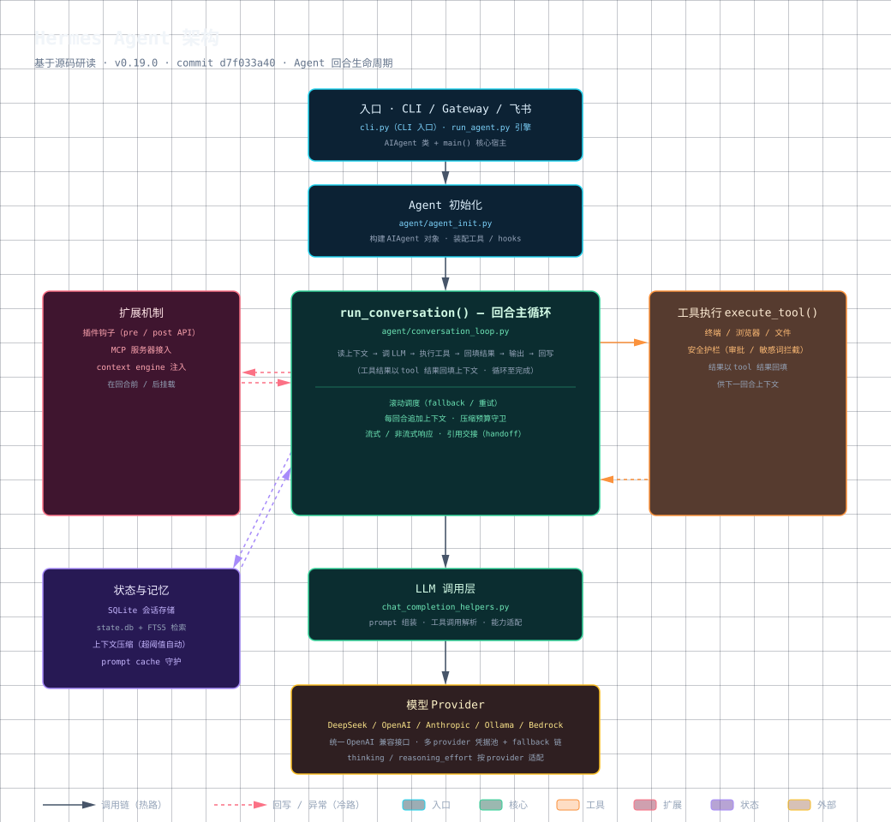
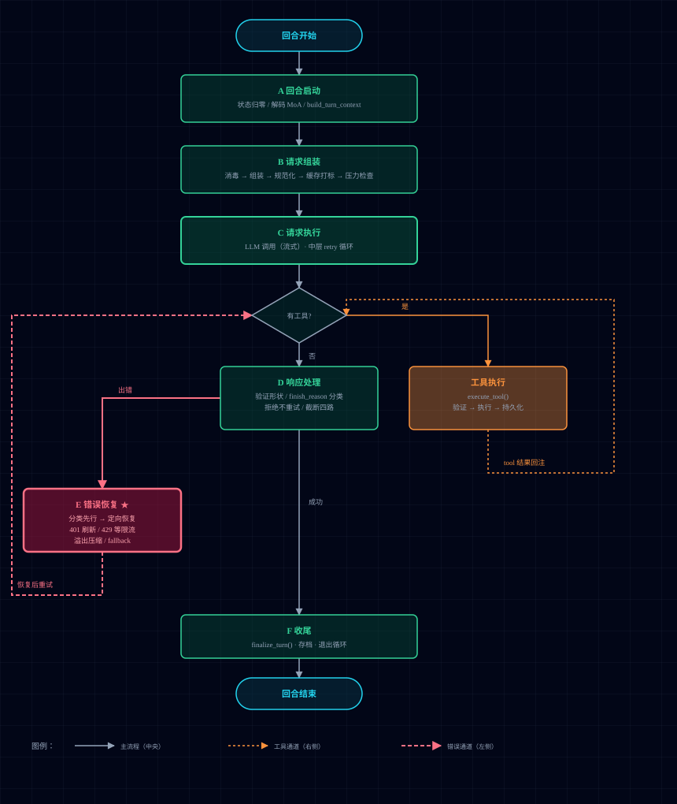

# Hermes Agent 源码研读笔记

> 深度研读 [Hermes Agent](https://github.com/NousResearch/hermes-agent)（22 万+ star 的开源 AI Agent 框架）核心源码，沉淀为面向读者的设计解读。

## 为什么读 Hermes

Hermes 是一个**生产级 Agent 框架**：它的价值不在"能调 LLM"，而在**把 Agent 从 demo 变成可靠系统**的系统性设计——错误恢复占了主循环一半以上代码、压缩四道闸、prompt cache 守护、角色交替硬约束。读它的源码，比读任何 Agent 教程都更接近"生产级 Agent 到底怎么设计"。

## 研读方法

1. **以 run_conversation 为主轴**（god function，一个 Agent 回合的完整生命周期）
2. **六阶段拆解**：回合启动 → 请求组装 → 请求执行 → 响应处理 → 错误恢复 → 工具执行与收尾
3. **分层读**：主流程 / 容错恢复 / 旁路钩子——三层逻辑混在一起，分清就不迷路
4. **锚点稳定**：笔记用「函数名 + 关键符号」定位（如 `_last_compaction_in_place`），不用行号——符号跨版本稳定

## 研读版本

| 项 | 值 |
|---|---|
| 框架 | Hermes Agent |
| 版本 | v0.19.0 |
| Commit | `d71033a40` |
| 主文件 | `agent/conversation_loop.py` |
| 回合主循环函数 | `run_conversation()` |
| 研读时间 | 2026-07 ~ 2026-08 |

> 笔记中的函数名/符号基于上述版本；跨版本定位请按函数名搜索，勿依赖行号。

## 架构总览

[](assets/hermes-agent-architecture.html)
（浏览器打开架构图，README 内嵌为 SVG 预览）

```
入口（CLI/Gateway/飞书）
  → agent_init.py（组装 agent）
    → run_conversation()（Agent 回合主循环）
      → chat_completion_helpers.py（LLM 调用：流式/非流式、认证池、fallback）
        → 模型 Provider（DeepSeek/OpenAI/Anthropic/Ollama/Bedrock）
      ↖ 工具执行回环（execute_tool）
  → 扩展：插件钩子 / MoA / context engine
  → 状态：SQLite 会话 / 上下文压缩 / prompt cache
```

## 主循环流程

[](assets/run-conversation-flow.html)
（浏览器打开 HTML 查看完整流程，README 内嵌 SVG 预览——三层循环、工具通道回环、错误恢复分支）

## 笔记地图

全部 35 篇，按主题分组，点击笔记名直接跳转；每篇笔记顶部有返回地图的导航条。

### 核心：主循环六阶段（7 篇）

| 笔记 | 覆盖 |
|---|---|
| [conversation-loop-run-conversation](notes/conversation-loop-run-conversation.md) | run_conversation 全解（总览） |
| [hermes-loop-entry-phase](notes/hermes-loop-entry-phase.md) | 阶段 A：回合启动与迭代准备 |
| [hermes-request-assembly-extras](notes/hermes-request-assembly-extras.md) | 阶段 B：请求组装 |
| [hermes-request-execution-phase](notes/hermes-request-execution-phase.md) | 阶段 C：请求执行 |
| [hermes-response-handling-phase](notes/hermes-response-handling-phase.md) | 阶段 D：响应处理 |
| [hermes-error-recovery-phase](notes/hermes-error-recovery-phase.md) | 阶段 E：错误恢复（面试重点） |
| [hermes-tool-execution-finalize-phase](notes/hermes-tool-execution-finalize-phase.md) | 阶段 F：工具执行与收尾 |

### 关键机制（10 篇）

| 笔记 | 主题 |
|---|---|
| [hermes-compression-per-turn-state-reset](notes/hermes-compression-per-turn-state-reset.md) | 压缩状态管理（gateway 复用 agent 对象） |
| [hermes-moa-context-injection](notes/hermes-moa-context-injection.md) | MoA 多模型协作 |
| [hermes-message-normalization](notes/hermes-message-normalization.md) | 消息规范化（prompt cache 字节稳定） |
| [hermes-anthropic-cache-control](notes/hermes-anthropic-cache-control.md) | Anthropic 缓存打标 |
| [hermes-build-turn-context](notes/hermes-build-turn-context.md) | 回合上下文组装（12 字段） |
| [hermes-credential-pool-turn-reset](notes/hermes-credential-pool-turn-reset.md) | 认证池（多 key 轮换） |
| [hermes-message-sanitize](notes/hermes-message-sanitize.md) | 消息消毒 |
| [hermes-prefill-messages](notes/hermes-prefill-messages.md) | prefill 示范注入 |
| [hermes-tool-schema-registry](notes/hermes-tool-schema-registry.md) | 工具 schema 注册 |
| [hermes-context-engine-selection](notes/hermes-context-engine-selection.md) | context engine 注入钩子 |

### 专题深挖（8 篇）

| 笔记 | 主题 |
|---|---|
| [hermes-api-messages-build](notes/hermes-api-messages-build.md) | api_messages 翻译层 |
| [hermes-loop-counter-init](notes/hermes-loop-counter-init.md) | 主循环计数器初始化 |
| [hermes-interim-text-dedup](notes/hermes-interim-text-dedup.md) | 过程旁白去重 |
| [hermes-interrupt-partial-response-save](notes/hermes-interrupt-partial-response-save.md) | 中断时抢救半截回答 |
| [hermes-pre-api-pressure-check](notes/hermes-pre-api-pressure-check.md) | 发请求前的压力检查 |
| [hermes-run-conversation-forwarder](notes/hermes-run-conversation-forwarder.md) | 入口转发器 |
| [hermes-step-callback-explained](notes/hermes-step-callback-explained.md) | step_callback 进度广播 |
| [hermes-tool-call-message-structure](notes/hermes-tool-call-message-structure.md) | 工具调用消息合法结构 |

### 故障排查与实战（6 篇）

| 笔记 | 主题 |
|---|---|
| [hermes-cron-job-troubleshooting-2026-07-27](notes/hermes-cron-job-troubleshooting-2026-07-27.md) | Cron 排查实录 |
| [hermes-desktop-launch-and-feishu-fix](notes/hermes-desktop-launch-and-feishu-fix.md) | Desktop 启动 + 飞书修复 |
| [hermes-feishu-adapter-setup](notes/hermes-feishu-adapter-setup.md) | 飞书适配器配置与设计 |
| [hermes-feishu-markdown-issue](notes/hermes-feishu-markdown-issue.md) | 飞书 markdown 取舍 |
| [hermes-obsidian-llm-wiki-setup](notes/hermes-obsidian-llm-wiki-setup.md) | Hermes + Obsidian 第二大脑 |
| [hermes-skill-nudge](notes/hermes-skill-nudge.md) | 让 Agent 主动沉淀经验 |

### 环境与配套（4 篇）

| 笔记 | 主题 |
|---|---|
| [hermes-agent-init-refactoring](notes/hermes-agent-init-refactoring.md) | init_agent 重构（巨型构造函数 → 可测试） |
| [hermes-agent-init-structure](notes/hermes-agent-init-structure.md) | init_agent 编排（60+ 参数组装） |
| [hermes-provider-profile-design](notes/hermes-provider-profile-design.md) | ProviderProfile 声明式设计 |
| [hermes-steer-mechanism](notes/hermes-steer-mechanism.md) | /steer 递纸条机制 |

## 亮点（可引用的问题编号）

笔记中引用的 issue 均为真实存在，是深度研读的证据：
- `#38763` in-place 压缩 · `#44837` 角色交替修复 · `#62625` 静默溢出 · `#32421` 流式内容过滤 · `#26080` 认证池 401 死循环

## 许可证

笔记为个人研读产出，基于 MIT 协议的开源项目 Hermes Agent；如需引用请注明来源。
